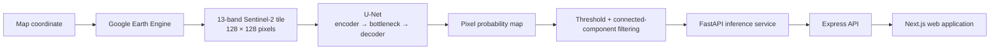

# EcoWatch — Mining Detection from Satellite Imagery

EcoWatch uses **Sentinel-2 satellite imagery** and **semantic segmentation** to identify areas associated with artisanal and small-scale gold mining (ASGM) in Ghana. A 13-band U-Net predicts a pixel-level mining mask, and a companion web application lets users analyse locations from an interactive map.

[](https://www.python.org/)
[](https://pytorch.org/)
[](https://fastapi.tiangolo.com/)
[](https://dataspace.copernicus.eu/explore-data/data-collections/sentinel-data/sentinel-2)

**Repositories:** [ML model and inference API](https://github.com/2026-Final-Year-Project/Ecowatch-model) · [Next.js web application](https://github.com/2026-Final-Year-Project/EcoWatch)

## Problem

Artisanal and small-scale mining can alter land cover across large and difficult-to-monitor areas. Reviewing satellite scenes manually is slow and does not scale. EcoWatch explores whether a segmentation model can highlight mining-related pixels so that analysts can prioritise locations for further investigation.

> EcoWatch is a screening tool, not proof that an activity is illegal. Predictions should be reviewed alongside current imagery and local evidence.

## Approach

1. Pair 13-band Sentinel-2 tiles with labelled mining masks from **SmallMinesDS**.
2. Split 4,270 samples into 3,416 training, 427 validation, and 427 held-out test images.
3. Train a U-Net on `13 × 128 × 128` inputs using a combined binary cross-entropy and Dice loss.
4. Convert the model's probability map into a binary segmentation mask at a `0.5` threshold.
5. Remove very small connected regions and return the detected area, confidence level, and mask through a FastAPI service.

## Architecture



The U-Net has four encoder and decoder stages with skip connections and feature sizes of 32, 64, 128, and 256. The deployed service retrieves a 1.28 km square Sentinel-2 tile, runs CPU inference, and reports confirmed regions of at least 25 connected pixels (0.25 hectares at 10 m resolution).

## Demo

The companion [EcoWatch web application](https://github.com/2026-Final-Year-Project/EcoWatch) provides an interactive map, coordinate analysis, current and historical imagery, community reporting, analysis history, and printable reports.

<p align="center">
  <a href="https://github.com/2026-Final-Year-Project/EcoWatch">
    
  </a>
</p>

For a reproducible model demo, open the final section of [`03_unet_training_evaluation.ipynb`](notebooks/03_unet_training_evaluation.ipynb). It displays held-out examples in three columns:

| Sentinel-2 RGB composite | Ground-truth mask | Predicted mask |
| :---: | :---: | :---: |
| 13-band input visualised as natural colour | Human-labelled mining pixels | U-Net output at threshold 0.5 |

## Setup

### Prerequisites

- Python 3.10 or newer
- A Google Cloud project with the Earth Engine API enabled
- An Earth Engine-authenticated Google account
- The trained `best_model.pt` checkpoint placed at `models/best_model.pt`

### Run the inference API

```bash
git clone https://github.com/2026-Final-Year-Project/Ecowatch-model.git
cd Ecowatch-model

python -m venv .venv
source .venv/bin/activate
python -m pip install -r requirements.txt

cp .env.example .env
earthengine authenticate
```

Set `EE_PROJECT` in `.env` to your Earth-Engine-enabled Google Cloud project, then export the variables and start the API:

```bash
set -a
source .env
set +a
uvicorn app:app --reload --port 8000
```

Check the service at [http://localhost:8000/health](http://localhost:8000/health). Interactive API documentation is available at [http://localhost:8000/docs](http://localhost:8000/docs).

### Connect the web application

Clone the [EcoWatch web repository](https://github.com/2026-Final-Year-Project/EcoWatch), set the backend's `MODEL_API_URL` to `http://localhost:8000`, and follow its README to start the Express API and Next.js frontend.

The prediction endpoint accepts a coordinate and optional date range:

```bash
curl -X POST http://localhost:8000/v1/predict/coordinate \
  -H "Content-Type: application/json" \
  -d '{"latitude": 6.2, "longitude": -1.6}'
```

## Results

The best checkpoint was selected using validation Dice and evaluated once on the fixed held-out test set.

| Metric | Score |
| --- | ---: |
| Held-out test Dice | **0.7056** |
| Held-out test IoU | **0.6434** |
| Best validation Dice | **0.7450** |
| Test loss | **0.3060** |
| Best epoch | **25 / 30** |

These are segmentation metrics from 427 held-out SmallMinesDS images. Dice and IoU measure overlap between the predicted and labelled mining masks; higher is better. The reusable evaluation code is in [`src/evaluation/`](src/evaluation/), while qualitative experiment outputs remain available in [`03_unet_training_evaluation.ipynb`](notebooks/03_unet_training_evaluation.ipynb).

## Repository structure

```text
Ecowatch-model/
├── app.py                              # FastAPI routes
├── assets/                             # README and demo assets
├── configs/unet.json                   # Reproducible training configuration
├── models/                             # Local model checkpoints
├── notebooks/                          # Exploration and experiment records
│   ├── 01_dataset_exploration.ipynb    # Inspect imagery and masks
│   ├── 02_unet_dataset_pipeline.ipynb  # Pair and split the dataset
│   └── 03_unet_training_evaluation.ipynb
├── scripts/
│   ├── prepare_dataset.py              # Discover pairs and export fixed splits
│   ├── train_model.py                  # Train from the command line
│   └── evaluate_model.py               # Evaluate a saved checkpoint
├── src/
│   ├── data/                            # TIFF preprocessing, splits, Dataset
│   ├── evaluation/                     # Dice, IoU, loss, held-out evaluation
│   ├── inference/                      # Checkpoint and array inference helpers
│   ├── models/unet.py                  # 13-band U-Net architecture
│   ├── training/                       # Epoch engine and training workflow
│   ├── utils/visualization.py          # Prediction visualisation
│   └── ecowatch_inference.py           # Earth Engine retrieval and inference
├── .env.example                        # Inference configuration template
└── requirements.txt
```

## Technologies

- **Model:** Python, PyTorch, NumPy, Rasterio
- **Imagery:** Sentinel-2, Google Earth Engine
- **Serving:** FastAPI, Uvicorn, Pydantic
- **Web application:** Next.js, React, Express, Leaflet, Tailwind CSS

## Reproducing the experiment

The Python package is the primary implementation; the notebooks are retained as exploration and experiment records. After installing the requirements, reproduce the pipeline without Jupyter:

```bash
python -m scripts.prepare_dataset \
  --dataset-root /path/to/SmallMinesDS \
  --output-dir data/splits

python -m scripts.train_model \
  --train-csv data/splits/train_dataset.csv \
  --val-csv data/splits/val_dataset.csv \
  --output-dir experiments/unet_v1

python -m scripts.evaluate_model \
  --checkpoint experiments/unet_v1/best_model.pt \
  --test-csv data/splits/test_dataset.csv
```

The commands use [`configs/unet.json`](configs/unet.json), select the checkpoint with the best validation Dice score, and evaluate it on the fixed test split. The SmallMinesDS dataset is not redistributed in this repository.
